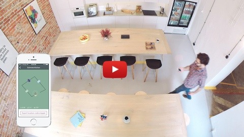
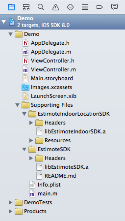
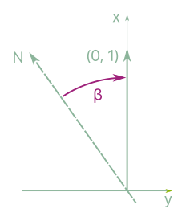

# Estimote Indoor Location SDK

Estimote Indoor Location SDK allows real-time beacon-based mapping and indoor location.

We know that building the next generation of context-aware mobile apps requires more than just iBeacon™ hardware. That's why we've built smarter software that abstracts away the difficulty of understanding proximity and position within a given space.

Estimote Indoor Location is a sophisticated software solution that makes it incredibly easy and quick to map any location. Once done, you can use our SDK to visualize your approximate position within that space in real-time, in your own app.

Indoor Location creates a rich canvas upon which to build powerful new mobile experiences, from in-venue analytics and proximity marketing to frictionless payments and personalized shopping.

Estimote Indoor Location works exclusively with Estimote Beacons.

Learn more:
- [Build an app with Indoor SDK](http://developer.estimote.com/indoor/build-an-app/) tutorial.
- Go through our [Developer Portal](http://developer.estimote.com/).
- Read comprehensive [SDK Documentation](http://estimote.github.io/iOS-Indoor-SDK/).
- Download our [Estimote Indoor Location app](https://itunes.apple.com/us/app/estimote-indoor-location/id963704810?mt=8) from App Store and play with Indoor Location.
- Check our [Community Portal](http://community.estimote.com/hc/en-us) for more information about Estimote platform.
- Post any remaining questions on [Estimote Community Forums](https://forums.estimote.com) to get help from Estimote and the beacon community.

## Table of Contents

* [How does Indoor Location work?](#how-does-indoor-location-work)
* [Installation](#installation)
* [Key Concepts](#key-concepts)
* [Usage](#usage)
  * [Setting up a new location](#setting-up-a-new-location)
    * [Manually, using EILLocationBuilder](#manually-using-eillocationbuilder)
    * [Via Estimote Indoor Location App](#via-estimote-indoor-location-app)
  * [Obtaining position update inside the location](#obtaining-position-update-inside-the-location)
  * [Managing locations in the cloud](#managing-locations-in-the-estimote-cloud)
* [Changelog](#changelog)

## How does Indoor Location work?

Indoor Location SDK enables creating location through builder and obtaining position updates from the location. Besides location builder there is also possibility of mapping location through Estimote Indoor Location App.

The mapping process is simple. First, you'll need to map the shape. Start by walking around a location and stick as close to the perimeter as possible. Remember to hold the phone in front of you for the location to be mapped properly. The app will now suggest the number and placement of beacons. Affix them on the walls at chest height.  To finalize the process walk around the location once more (again with the phone in front of you). Stop at each beacon along the way, to complete this one-time configuration process.

There is a nice video tutorial by [@phillydev716](https://twitter.com/phillydev716) on [YouTube on how to use Indoor Location in your app](https://www.youtube.com/watch?v=BjXHBBvrWQ0). Please note, that video tutorial uses older version of our SDK (v.1.6).

[](https://www.youtube.com/watch?v=wtBERi7Lf3c)

## Installation

SDK is available as ```EstimoteIndoorSDK``` in [CocoaPods](http://cocoapods.org/). Installation is just a matter of putting following line in your ```Podfile```.

```
pod 'EstimoteIndoorSDK'
```


Alternatively you can add SDK manually:

1. Drag-and-drop the EstimoteIndooLocationSDK directory (containing libEstimoteIndoorLocationSDK.a, Headers and Resources) into your project in Xcode. Make sure the "copy items if needed" checkbox is selected.

2. If you are not already using EstimoteSDK in your project, add EstimoteSDK framework to your project.
This is what your catalogue structure should look like:

   

3. Open your project settings and go to the "Build Phases" tab. In the "Link library with binaries" section click the "+" button and add the following frameworks that are required by EstimoteIndoorLocationSDK:

    * CoreMotion.framework
    * AudioToolbox.framework
    * MediaPlayer.framework
    * MessageUI.framework
    * libz.tbd
    
   While you're on this tab already, double-check if `libEstimoteIndoorSDK.a` is included in the "Link library with binaries" list. This should've happened automatically when you were copying the EstimoteIndooLocationSDK directory into the project during step 1. If for some reason it didn't, drag-and-drop the `libEstimoteIndoorSDK.a` file from the Project navigator onto the list.

4. Go to "Build Settings", find "Other Linker Flags" and add `-lc++`. Additionally, set `Enable Bitcode` to `NO`.

5. That's it! By this point, your project should compile successfully and you should be able to start using EstimoteIndoorLocationSDK.

6. If you're coding in Swift, there's one more extra step necessary: to add a Bridging header file to expose Objective-C headers to Swift.

   To do that first add a new file to the project - make it a `Header file` and call it `YourProjectName-Bridging-Header.h`. In this file you need to import the following header:

   ```
   #import "EILIndoorSDK.h"
   ```

   Finally, click on your project root item in the Project navigator and go to `Build Settings` tab. Make sure that `All` is selected, then look for `Objective-C Bridging Header` and set it to `$(PROJECT_DIR)/YourProjectName/YourProjectName-Bridging-Header.h`. Now you're good to go!

## Key concepts

Note that Estimote Indoor Location uses [Cartesian coordinate system](http://en.wikipedia.org/wiki/Cartesian_coordinate_system), which is different than [iOS coordinate system](https://developer.apple.com/library/ios/documentation/general/conceptual/Devpedia-CocoaApp/CoordinateSystem.html).

*Location* represents a physical location. It is a simple polygon constructed out of points.

*Location* has a property *orientation* which denotes angle between magnetic north and vector ```[0, 1]``` counted clockwise. See following image for graphic description:



On a *location*’s boundary segments can be placed doors, windows which are called *linear objects*.


## Usage

### Setting up a new location

There are two ways of setting up a new location. You can use for this purpose ```ESTIndoorLocationBuilder```, as manual tool, or [Estimote App](https://itunes.apple.com/us/app/estimote/id686915066?mt=8) and fetch location from cloud.

#### Manually, using EILLocationBuilder

You have the option to create an ```EILLocation``` manually. For that use the [EILLocationBuilder](http://estimote.github.io/iOS-Indoor-SDK/Classes/EILLocationBuilder.html) class.

In order to construct a new location you need to:

- set the shape of the location and its orientation
- add details such as beacons, walls, doors on boundary segments

The shape of the location is defined by its boundary points. For example, consider a square defined by points (0,0), (0,5), (5,5), (5,0) along with its orientation with respect to magnetic north.

```objective-c
EILLocationBuilder *locationBuilder = [EILLocationBuilder new];
[locationBuilder setLocationBoundaryPoints:@[
[EILPoint pointWithX:0 y:0],
[EILPoint pointWithX:0 y:5],
[EILPoint pointWithX:5 y:5],
[EILPoint pointWithX:5 y:0]]];

[locationBuilder setLocationOrientation:0];
```

Points that define the shape of location also define its boundary segments. They are indexed in the same order as the points. In this example there would be the following 4 segments: [(0,0), (0,5)], [(0,5), (5,5)], [(5,5), (5,0)], [(5,0), (0,0)].

The next step is to place beacons and doors in the location:

```objective-c
[locationBuilder addBeaconIdentifiedByIdentifier:@"aabbccddeeff"
atBoundarySegmentIndex:0
inDistance:2
fromSide:EILLocationBuilderLeftSide];
```

Using ```ESTIndoorLocationBuilder``` you can also place beacons inside the location (addBeaconWithIdentifier:withPosition:, addBeaconWithIdentifier:withPosition:andColor:), which is not possible with mapping tool in Indoor Location App.

Note that methods used for adding beacons that are identified by their mac addresses are now depracated. Please use methods using identification by identifier instead.

#### Via Estimote Indoor Location App

Using [Estimote App](https://itunes.apple.com/us/app/estimote/id686915066?mt=8) the procedure consists of the following steps:

- configuring beacons
- placing beacons
- mapping the physical location to an instance of ```EILLocation```

If you mapped a location it was automatically uploaded to your Estimote Cloud account. You can fetch it from Estimote Cloud in your own app (see section: [Managing locations in the cloud](#managing-locations-in-the-estimote-cloud)).

### Obtaining position update inside the location

Once you have instance of ```EILLocation``` you can start monitoring and obtaining position updates for that location.

Monitoring location is simply determining if the user is currently inside or outside the location. In order to monitor location, first you need to create instance of ```EILIndoorLocationManager``` and start monitoring for that location.

```objective-c
EILIndoorLocationManager *indoorLocationManager = [EILIndoorLocationManager new];
[indoorLocationManager startMonitoringForLocation:yourLocation];
```

To obtain position updates, you need to set a ```delegate``` which will be receiving the updates.

```objective-c
indoorLocationManager.delegate = yourDelegate;
[indoorLocationManager startPositionUpdatesForLocation:yourLocation];
```
In addition to position, updates provide also information about accuracy of determined position which can be visualized via EILPositionView or EILPositionNode as avatar with a circle of given radius within which the real position is expected to be.

Note, that you need only one Indoor Location Manager to monitor multiple locations. However, position updates are available for only one location at the same time. If you need to enable position updates for new location, first you need to stop position updates:

```objective-c
[indoorLocationManager stopPositionUpdates];
```
In order to have Indoor Location status change and position updates without delay, you should start Indoor Location Manager and monitioring for Indoor Location early.

EILIndoorLocationManager position updates can be delivered in two different modes. Modes differ in accuracy, stability and responsiveness. Depending on the mode system resource usage may be different.
- `EILIndoorLocationManagerModeNormal` - Delivers most accurate and responsive position updates at the cost of high system resource usage. To achieve best results user should hold phone in hand in portrait orientation. This is default mode of `EILIndoorLocationManager`.
- `EILIndoorLocationManagerModeLight` - Delivers stable, but a bit less responsive position updates. Has a very low system resource usage.

In order to change mode simply change `mode` property of `EILIndoorLocationManager` object.

```objective-c
indoorLocationManager.mode = EILIndoorLocationManagerModeLight;
```
If the position updates delivery is in progress it will effectively restart position updates with new mode.

### Managing locations in the Estimote Cloud

To manage your locations, you can use requests that allows communication with Estimote Cloud.

Provided requests are as follows:
- ```EILRequestAddLocation``` - request for saving a new location to Estimote Cloud
- ```EILRequestRemoveLocation``` - request for removing a new location from Estimote Cloud
- ```EILRequestFetchLocation``` - request for fetching location identified by its identifier. Location has to be public or belong to currently authorized user
- ```EILRequestFetchPublicLocations``` - request for fetching public nearby locations
- ```EILRequestFetchLocations``` - request for fetching locations from Estimote Cloud for currently authorized user
- ```EILRequestModifyLocation``` - request for modifying already existing location in Estimote Cloud

Each location saved in Estimote Cloud is given a unique string identifier that corresponds to the `identifier` property of `EILLocation`. You can find it on cloud.estimote.com, on the "Locations" screen, and use it with the Indoor SDK to, among other things, fetch your stored location from Estimote Cloud. Example of fetching location by identifier can be seen below:

```objective-c
EILRequestFetchLocation *request = [[EILRequestFetchLocation alloc] initWithLocationIdentifier:yourLocationIdentifier];
[request sendRequestWithCompletion:^(EILLocation *location, NSError *error) {

if (!error)
{
self.myLocation = location;
}
}];

```

Please note that in order to have these methods working you need to be authenticated in Estimote Cloud. To do that you have to call -[ESTConfig setupAppID:andAppToken:] first.

```objective-c
#import "EILIndoorLocationManager.h"
#import "ESTConfig.h"

[ESTConfig setupAppID:@"yourAppID" andAppToken:@"yourAppToken"];
```

You can find your API App ID and API App Token in the [Apps](http://cloud.estimote.com/#/apps) section of the [Estimote Cloud](http://cloud.estimote.com/).

You can check the authorization status using the following method that will return a BOOL value:
```objective-c
[ESTConfig isAuthorized]
```

## Changelog

To see what has changed in recent versions of Estimote Indoor Location SDK, see the [CHANGELOG](CHANGELOG.md).


