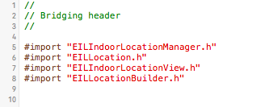

# Estimote Indoor Location SDK

Estimote Indoor Location SDK allows real-time beacon-based mapping and indoor location.

We know that building the next generation of context-aware mobile apps requires more than just iBeacon™ hardware. That's why we've built smarter software that abstracts away the difficulty of understanding proximity and position within a given space.

Estimote Indoor Location is a sophisticated software solution that makes it incredibly easy and quick to map any location. Once done, you can use our SDK to visualise your approximate position within that space in real-time, in your own app.

Indoor Location creates a rich canvas upon which to build powerful new mobile experiences, from in-venue analytics and proximity marketing to frictionless payments and personalised shopping.

Estimote Indoor Location works exclusively with Estimote Beacons.

Learn more:
- Comprehensive [SDK Documentation](http://estimote.github.io/iOS-Indoor-SDK/).
- Play with [SDK Examples](Examples) written in Objective-C and Swift.
- Download our [Estimote app](https://itunes.apple.com/us/app/estimote/id686915066?mt=8) from App Store and play with Indoor Location.
- Check our [Community Portal](http://community.estimote.com/hc/en-us) to get the answers for the most common questions.


## Table of Contents

* [How does Indoor Location work?](#how-does-indoor-location-work)
* [Installation](#installation)
* [Key Concepts](#key-concepts)
* [Usage](#usage)
  * [Setting up a new location](#setting-up-a-new-location)
    * [Using the built-in Location Setup ViewController](#using-the-built-in-location-setup-viewcontroller)
    * [Manually, using ESTLocationBuilder](#manually-using-estlocationbuilder)
    * [From JSON](#from-json)
  * [Obtaining position update inside the location](#obtaining-position-update-inside-the-location)
* [Changelog](#changelog)

## How does Indoor Location work?

Indoor Location SDK consists of two parts: mapping a location and obtaining position updates from the location.

The mapping process is simple and fast. Start by placing one beacon immediately to the right of the room's entrance at about chest height. Affix a single beacon in the center of each of the remaining walls. Then walk from beacon to beacon keeping as close to the perimeter of the space as possible. While walking, hold your phone in front of you. Stop at each beacon along the way, holding the phone next to it, to complete this one-time configuration process. 

Once integrated with your app, our dedicated UIViewController will guide the users of your application through mapping of their own locations.

[](https://www.youtube.com/watch?v=wtBERi7Lf3c)

## Installation

1. Copy the EstimoteIndooLocationSDK directory (containing libEstimoteIndoorLocationSDK.a, Headers and Resources) into your project.
2. If you are not already using EstimoteSDK in your project, do the same for EstimoteSDK directory.
This is what your catalogue structure should look like:

  

3. Open your project settings and go to the "Build Phases" tab. In the "Link library with binaries" section click the "+" button and add the following frameworks that are required by EstimoteSDK and EstimoteIndoorLocationSDK:
    * CoreGraphics.framework
    * SystemConfiguration.framework
    * CoreBluetooth.framework
    * CoreLocation.framework
    * CoreMotion.framework
    * AudioToolbox.framework
    * AVFoundation.framework
    * MediaPlayer.framework
    * MessageUI.framework
4. That's it! By this point, your project should compile successfully and you should be able to start using EstimoteIndoorLocationSDK. 
5. If you're coding in Swift, there's one more extra step necessary: to add a Bridging header file to expose Objective-C headers to Swift.

   To do that first add a new file to the project - make it a `Header file` and call it `YourProjectName-Bridging-Header.h`. In this file you need to import the following EstimoteIndoorLocationSDK and EstimoteSDK headers:

   ```
   #import "ESTIndoorLocationManager.h"
   #import "ESTLocation.h"
   #import "ESTIndoorLocationView.h"
   #import "ESTLocationBuilder.h"
   ```

   After all that, your Briding header could look like this:

   

   Finally, click on your project root item in the Project navigator and go to `Build Settings` tab. Make sure that `All` is selected, then look for `Objective-C Bridging Header` and set it to `$(PROJECT_DIR)/YourProjectName/YourProjectName-Bridging-Header.h`. Now you're good to go!

## Key concepts

Note that Estimote Indoor Location uses [Cartesian coordinate system](http://en.wikipedia.org/wiki/Cartesian_coordinate_system), which is different than [iOS coordinate system](https://developer.apple.com/library/ios/documentation/general/conceptual/Devpedia-CocoaApp/CoordinateSystem.html).

*Location* represents a physical location. It is a simple polygon constructed out of points.

*Location* has a property *orientation* which denotes angle between vector ```[0, 1]``` and magnetic north counted clockwise. See following image for graphic description.


On a *location*’s boundary segments can be placed doors, windows which are called *linear objects*.


## Usage

### Setting up a new location

#### Using the built-in Location Setup ViewController

First you need to import the ESTIndoorLocationManager class header file. Then you need to set up your appID and appToken using the following method:
```objective-c
#import "ESTIndoorLocationManager.h"

[ESTIndoorLocationManager setupAppID:@"yourAppID" andAppToken:@"yourAppToken"];
```

You can find your API App ID and API App Token in the [Account Settings](http://cloud.estimote.com/#/account) section of the [Estimote Cloud](http://cloud.estimote.com/).

You can check the authorization status using the following method that will return a BOOL value:
```objective-c
[ESTIndoorLocationManager isAuthorized]
```

In order to obtain precise position updates you need to prepare a physical location for Estimote Indoor Location.
The procedure consists of the following steps:

- configuring beacons
- placing beacons
- mapping the physical location to an instance of ```ESTLocation```
 
Invoke ```[ESTIndoorLocationManager locationSetupControllerWithCompletion:]``` to obtain a dedicated UIViewController that guides you through this process.
The result of this procedure is a prepared physical location and an instance of ```ESTLocation``` that can be used for obtaining position updates.

#### Manually, using ESTLocationBuilder

You have the option to create an ```ESTLocation``` manually. For that use the ```ESTLocationBuilder``` class.

In order to construct a new location you need to:

- set the shape of the location and its orientation
- add details such as beacons, walls, doors on boundary segments

The shape of the location is defined by its boundary points. For example, consider a square
defined by points (0,0), (0,5), (5,5), (5,0) along with its orientation with respect
to magnetic north.

```objective-c
ESTLocationBuilder *locationBuilder = [ESTLocationBuilder new];
[locationBuilder setLocationBoundaryPoints:@[
    [ESTPoint pointWithX:0 y:0],
    [ESTPoint pointWithX:0 y:5],
    [ESTPoint pointWithX:5 y:5],
    [ESTPoint pointWithX:5 y:0]]];

[locationBuilder setLocationOrientation:0];
```

Points that define the shape of location also define its boundary segments. They are indexed
in the same order as the points. In this example there would be the following 4 segments: [(0,0), (0,5)], [(0,5), (5,5)],
[(5,5), (5,0)], [(5,0), (0,0)].

The next step is to place beacons and doors on the boundary segments of the location:

```objective-c
[locationBuilder addBeaconIdentifiedByMac:@"AA:AA:AA:AA:AA:AA"
                   atBoundarySegmentIndex:0
                               inDistance:2
                                 fromSide:ESTLocationBuilderLeftSide];
```

#### From JSON

If you mapped a location in [Estimote App](https://itunes.apple.com/us/app/estimote/id686915066?mt=8) you can export it by tapping on ```Export location code snippet```.

The resulting JSON can be parsed into an ```ESTLocation``` object by invoking ```[ESTLocationBuilder parseFromJSON:]```.

See also [SDK Examples](Examples) for how to do this.

### Obtaining position update inside the location

Once you have instance of ```ESTLocation``` you can start obtaining position updates for that location.
First you need to set a ```delegate``` which will be receiving the updates and then start the manager for
the location. Note that only one location at a time is supported.
 
```objective-c
ESTIndoorLocationManager * indoorLocationManager = [indoorLocationManager.delegate new];
indoorLocationManager.delegate = yourDelegate;
[indoorLocationManager startIndoorLocation:yourLocation];
```

Do not forget to stop the manager if you are not using location updates any more.

```objective-c
[indoorLocationManager stopIndoorLocation];
```

See also [SDK Examples](Examples) for how to do this.

## Changelog

To see what has changed in recent versions of Estimote Indoor Location SDK, see the [CHANGELOG](CHANGELOG.md).
